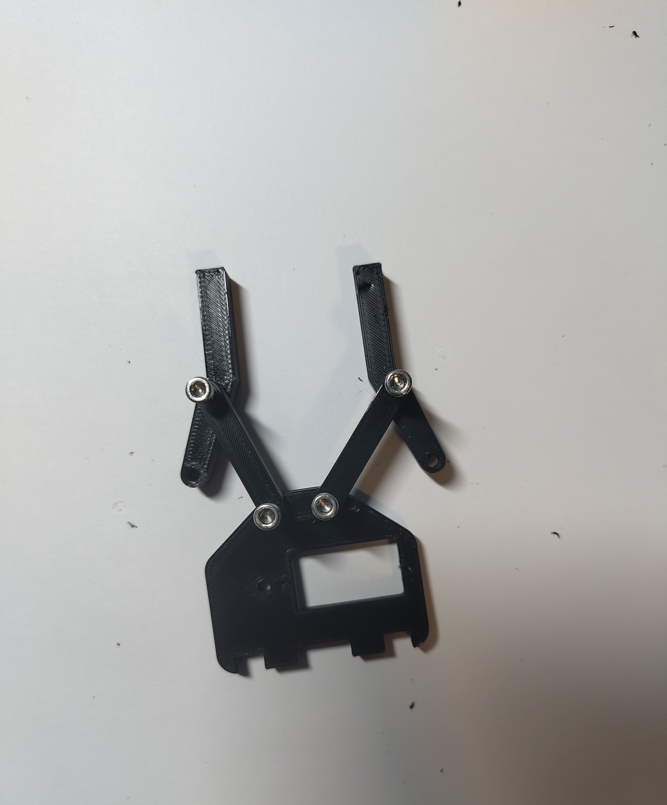

# Servo Roboter-Arm

Der Roboter-Arm basiert auf [diesem Projekt](https://www.printables.com/model/414563-9g-servo-arm).
Unter [Bauteile](Bauteile) findest du die Teile, um dir so einen Arm selber zu bauen.

Wir verwenden hier noch einen [Arduino Uno](https://store.arduino.cc/collections/uno/products/arduino-uno-rev3) und ein [PCA9685 Servotreiber-Modul von AZ-Delivery](https://www.az-delivery.de/products/pca9685-servotreiber).

Es sind noch vier Potentiometer verbaut, die im Programm z.B. verwendet werden können, um jeden Motor auf eine bestimmte Position zu setzen.

Damit die Servos zuverlässig funktionieren, sollte man das Servotreiber-Modul direkt von einem 5V-Netzteil betreiben, das mindestens 2 A Strom liefern kann.

Die Servos für den Greifer und das obere Gelenk sind billige Standard-9g-Servos aus der Riege Aliexpress (Suchbegriffe können sein `Servo`, `9g`, `SG90`).

Für die beiden unteren Gelenke waren diese Servos nicht stark genug.
Also haben wir dafür Servos vom Typ `Corona DS-939MG` verwendet, die zum Beispiel [hier](https://vgr-rc.de/p/corona-servo-ds939mg-ii-digital-metall-heli-t-rex-450-0-14sec-4-1kg-15-1g-450-ds-939mg) erhältlich sind.

Weil die etwas andere Maße haben als die Standard-Billoservos, haben wir die entsprechenden 3D-Druckteile ([DS-939MG-socket.stl](Bauteile/DS-939MG-socket.stl) und [DS-939MG-9gServoCageFor.stl](Bauteile/DS-939MG-9gServoCageFor.stl)) noch etwas angepasst.

[servoArmPfad.ino](servoArmPfad/servoArmPfad.ino) ist ein Beispielprogramm für den Arduino, mit dem der Arm einen vorgegebenen Pfad abfährt:

## Steuerung mit Potentiometer

Optional - Bezahlt: [ZIP Tile Halter für Arduino und Potentiometer](https://www.printables.com/model/1248946-zip-tile-set)

[Potentiometer Mutter, zum befestigen des Potentiometers am ZIP Tile Halter](https://www.thingiverse.com/thing:3502477)

[Potentiometer Knopf](https://www.printables.com/model/100359-potentiometer-knobs)

### Pinout Potentiometer

| 1. Pin | 2. Pin | 3. Pin |
| -- | -- | -- |
| 5V | Output | GND |

## Zusammenbau Greifer (Claw)

Zunächst werden alle Bauteile benötigt. Damit diese möglichst einfach mit einem kleinen Servo funktionieren, ist es am besten, alle Löcher mit einem 3-mm-Bohrer nachzubohren. Außerdem benötigt man M3-Schrauben mit 20 mm Länge.

Beim ersten Schritt ist es wichtig, darauf zu achten, dass die Grundplatte so liegt, wie hier abgebildet.

Anschließend können die Bauteile mit den M3-Schrauben zusammengesteckt werden. Die Schrauben werden so weit durchgeschraubt, bis sie am Ende anstoßen. In diesem Schritt sollten sie jedoch nicht ganz reingeschraubt werden.

Als Nächstes kommen nicht nur die Verbinder, sondern auch die richtigen Greifer. Auch hier ist es wieder sehr wichtig, auf die richtige Position zu achten. Die beiden Enden mit den Schraublöchern sollten nach unten zeigen.

Als Nächstes wird das linke Zahnrad verbunden. Man erkennt es daran, dass es kein ganz flaches Bauteil ist, sondern eine Erhöhung hat, die nach unten zeigen muss.

Wenn man alles jetzt auf den Kopf stellt, sollte es so aussehen. In die Öffnung sollte jetzt auch der Servomotor verbaut werden. Dazu werden zwei kleine Kreuzschrauben zum Festschrauben benutzt.

**Wichtig:** Damit sich der Motor auch in die richtige Richtung bewegt, muss auf die richtige Position geachtet werden.

Nach dem Servo müssen auf der Unterseite noch die beiden Greiferverbinder angebracht werden.

Wenn man alles wieder zurückdreht, sollte es wie folgt aussehen:

Im nächsten Schritt wird das rechte Zahnrad angebracht. Hier ist es auch wieder wichtig, dass der Servomotor bereits die äußerste Position erreicht hat, bevor das Zahnrad aufgesteckt wird. Am Ende wird das Zahnrad wie auf der anderen Seite mit dem Greifer über eine Schraube verbunden und ist damit fertiggestellt.

Nachdem alles verschraubt wurde, sollte die Rückseite so ausehen:

